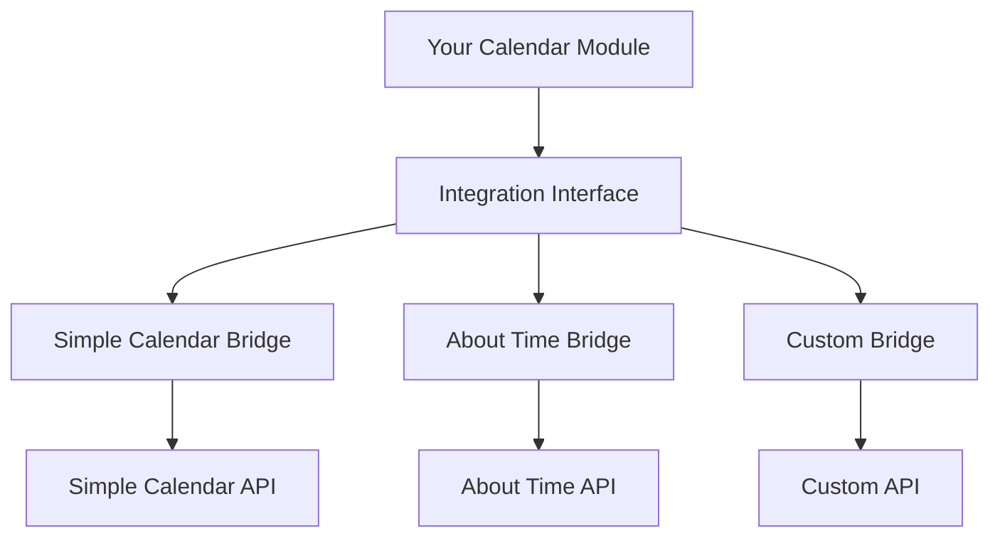

# Calendar Module Integration Guide

A comprehensive guide for calendar module developers who want to integrate with the Simple Calendar Compatibility Bridge using the Integration Interface pattern pioneered by Seasons & Stars.

## 📚 Table of Contents

- [Overview](#overview)
- [Integration Interface Pattern](#integration-interface-pattern)
- [Implementation Steps](#implementation-steps)
- [API Requirements](#api-requirements)
- [Widget Integration](#widget-integration)
- [Hook System](#hook-system)
- [Testing Your Integration](#testing-your-integration)
- [Bridge Integration](#bridge-integration)
- [Best Practices](#best-practices)
- [Example Implementation](#example-implementation)

## 🎯 Overview

The **Integration Interface pattern** allows calendar modules to provide clean, generic APIs that can be used by compatibility bridges and other integrations. This approach offers several advantages:

- **Clean Separation**: Your calendar module focuses purely on calendar functionality
- **Zero Simple Calendar Knowledge**: No need to implement Simple Calendar-specific code
- **Bridge Authority**: Compatibility bridges handle all format translations and quirks
- **Extensibility**: Same interface can support multiple compatibility bridges
- **Future-Proof**: Interface evolves independently of specific compatibility requirements

## 🔧 Integration Interface Pattern

### Core Concept

Instead of implementing Simple Calendar compatibility directly in your calendar module, you expose a **generic integration interface** that bridges can use:



### Interface Structure

```typescript
interface CalendarModuleIntegration {
  // Module identification
  isAvailable: boolean;
  version: string;
  
  // Core functionality
  api: CalendarAPI;
  widgets: CalendarWidgets;
  hooks: CalendarHooks;
  
  // Feature detection
  hasFeature(feature: string): boolean;
  getFeatureVersion(feature: string): string | null;
}
```

## 🚀 Implementation Steps

### Step 1: Define Your Integration Interface

Create the integration interface in your module's main initialization:

```typescript
// In your module's main setup (usually module.ts)
import { CalendarManager } from './calendar-manager';
import { CalendarWidget } from './ui/calendar-widget';

export class YourCalendarIntegration {
  constructor(
    private manager: CalendarManager,
    private mainWidget: CalendarWidget,
    private miniWidget?: CalendarMiniWidget
  ) {}

  get isAvailable(): boolean {
    return true; // Module is active and ready
  }

  get version(): string {
    return game.modules.get('your-calendar-module')?.version || '0.0.0';
  }

  get api(): YourCalendarAPI {
    return new YourCalendarAPI(this.manager);
  }

  get widgets(): YourCalendarWidgets {
    return new YourCalendarWidgets(this.mainWidget, this.miniWidget);
  }

  get hooks(): YourCalendarHooks {
    return new YourCalendarHooks();
  }

  hasFeature(feature: string): boolean {
    const features = {
      'date-conversion': true,
      'time-advancement': true,
      'widget-buttons': true,
      'calendar-switching': true,
      'notes-system': false // Example: not implemented yet
    };
    return features[feature] ?? false;
  }

  getFeatureVersion(feature: string): string | null {
    if (!this.hasFeature(feature)) return null;
    return this.version;
  }
}
```

### Step 2: Expose the Integration Interface

Add the integration interface to the global game object:

```typescript
// In your module's ready hook
Hooks.once('ready', () => {
  // Initialize your calendar system
  const manager = new CalendarManager();
  const mainWidget = new CalendarWidget();
  const miniWidget = new CalendarMiniWidget();
  
  // Expose integration interface
  (game as any).yourCalendar = {
    manager: manager,
    api: {}, // Your existing direct API (optional)
    
    // Integration interface for bridges
    integration: new YourCalendarIntegration(manager, mainWidget, miniWidget)
  };
  
  console.log('Your Calendar integration interface available');
});
```

### Step 3: Register with the Bridge

The Simple Calendar Compatibility Bridge will automatically detect your module if you follow the naming convention or register explicitly:

```typescript
// Optional: Explicit registration with the bridge
Hooks.callAll('calendar-module-ready', {
  moduleId: 'your-calendar-module',
  integration: (game as any).yourCalendar.integration
});
```

## 📋 API Requirements

Your `CalendarAPI` implementation should provide these core methods:

### Required Methods

```typescript
export class YourCalendarAPI {
  constructor(private manager: CalendarManager) {}

  // Core date operations
  getCurrentDate(): CalendarDate {
    return this.manager.getCurrentDate();
  }

  worldTimeToDate(timestamp: number): CalendarDate {
    return this.manager.worldTimeToDate(timestamp);
  }

  dateToWorldTime(date: CalendarDate): number {
    return this.manager.dateToWorldTime(date);
  }

  // Time advancement
  async advanceDays(days: number): Promise<void> {
    await this.manager.advanceTime(days * 24 * 60 * 60);
  }

  async advanceHours(hours: number): Promise<void> {
    await this.manager.advanceTime(hours * 60 * 60);
  }

  async advanceMinutes(minutes: number): Promise<void> {
    await this.manager.advanceTime(minutes * 60);
  }

  // Calendar management
  getActiveCalendar(): Calendar {
    return this.manager.getActiveCalendar();
  }

  async setActiveCalendar(calendarId: string): Promise<boolean> {
    return await this.manager.setActiveCalendar(calendarId);
  }

  getAvailableCalendars(): string[] {
    return this.manager.getAvailableCalendars();
  }

  // Date formatting
  formatDate(date: CalendarDate, options?: DateFormatOptions): string {
    return this.manager.formatDate(date, options);
  }
}
```

### Optional Methods

```typescript
// Calendar validation
validateDate(date: CalendarDate): boolean {
  return this.manager.validateDate(date);
}

// Calendar calculations
addDays(date: CalendarDate, days: number): CalendarDate {
  return this.manager.getEngine().addDays(date, days);
}

addMonths(date: CalendarDate, months: number): CalendarDate {
  return this.manager.getEngine().addMonths(date, months);
}

// Time-of-day calculations (for weather modules)
calculateSunrise(date: CalendarDate): CalendarDate {
  // Implementation depends on your calendar system
}

calculateSunset(date: CalendarDate): CalendarDate {
  // Implementation depends on your calendar system
}
```

## 🖼️ Widget Integration

Your `CalendarWidgets` implementation should support sidebar button management:

```typescript
export class YourCalendarWidgets {
  constructor(
    private mainWidget?: CalendarWidget,
    private miniWidget?: CalendarMiniWidget,
    private gridWidget?: CalendarGridWidget
  ) {}

  get main(): WidgetAPI | null {
    return this.mainWidget ? new WidgetAPI(this.mainWidget) : null;
  }

  get mini(): WidgetAPI | null {
    return this.miniWidget ? new WidgetAPI(this.miniWidget) : null;
  }

  get grid(): WidgetAPI | null {
    return this.gridWidget ? new WidgetAPI(this.gridWidget) : null;
  }
}

class WidgetAPI {
  constructor(private widget: any) {}

  addSidebarButton(name: string, icon: string, tooltip: string, callback: Function): void {
    // Implementation depends on your widget architecture
    this.widget.addSidebarButton(name, icon, tooltip, callback);
  }

  removeSidebarButton(name: string): void {
    this.widget.removeSidebarButton(name);
  }

  hasSidebarButton(name: string): boolean {
    return this.widget.hasSidebarButton(name);
  }

  static getInstance(): WidgetAPI | null {
    // Return the active instance of this widget type
    return this.widget?.getInstance() ? new WidgetAPI(this.widget.getInstance()) : null;
  }
}
```

### Widget Button Implementation

Your widgets should implement sidebar button functionality:

```typescript
export class CalendarWidget extends ApplicationV2 {
  private sidebarButtons: Array<{
    name: string;
    icon: string;
    tooltip: string;
    callback: Function;
  }> = [];

  addSidebarButton(name: string, icon: string, tooltip: string, callback: Function): void {
    // Prevent duplicates
    if (this.hasSidebarButton(name)) {
      console.warn(`Sidebar button '${name}' already exists`);
      return;
    }

    this.sidebarButtons.push({ name, icon, tooltip, callback });
    
    // Re-render if widget is already rendered
    if (this.rendered) {
      this.render();
    }
  }

  removeSidebarButton(name: string): void {
    const index = this.sidebarButtons.findIndex(btn => btn.name === name);
    if (index !== -1) {
      this.sidebarButtons.splice(index, 1);
      if (this.rendered) {
        this.render();
      }
    }
  }

  hasSidebarButton(name: string): boolean {
    return this.sidebarButtons.some(btn => btn.name === name);
  }

  // In your template context preparation
  async _prepareContext(options: any) {
    const context = await super._prepareContext(options);
    context.sidebarButtons = this.sidebarButtons;
    return context;
  }

  // In your event handlers
  _attachPartListeners(partId: string, htmlElement: HTMLElement, options: any): void {
    super._attachPartListeners(partId, htmlElement, options);

    // Handle sidebar button clicks
    htmlElement.addEventListener('click', (event) => {
      const button = event.target.closest('[data-action="sidebar-button"]');
      if (button) {
        const buttonName = button.dataset.buttonName;
        const sidebarButton = this.sidebarButtons.find(btn => btn.name === buttonName);
        if (sidebarButton) {
          try {
            sidebarButton.callback();
          } catch (error) {
            console.error(`Error in sidebar button callback for '${buttonName}':`, error);
          }
        }
      }
    });
  }
}
```

### Widget Template Updates

Add sidebar button support to your templates:

```handlebars
<!-- In your widget template (e.g., calendar-widget.hbs) -->
<div class="calendar-widget">
  <!-- Your existing widget content -->
  
  {{#if sidebarButtons}}
  <div class="sidebar-buttons">
    {{#each sidebarButtons}}
    <button type="button" 
            class="sidebar-button" 
            data-action="sidebar-button" 
            data-button-name="{{name}}"
            title="{{tooltip}}">
      <i class="{{icon}}"></i>
    </button>
    {{/each}}
  </div>
  {{/if}}
</div>
```

## 🪝 Hook System

Your `CalendarHooks` implementation should provide event management:

```typescript
export class YourCalendarHooks {
  private dateChangeCallbacks: Function[] = [];
  private calendarChangeCallbacks: Function[] = [];

  onDateChanged(callback: Function): void {
    this.dateChangeCallbacks.push(callback);
  }

  onCalendarChanged(callback: Function): void {
    this.calendarChangeCallbacks.push(callback);
  }

  // Call these methods when your calendar state changes
  emitDateChanged(event: DateChangeEvent): void {
    this.dateChangeCallbacks.forEach(callback => {
      try {
        callback(event);
      } catch (error) {
        console.error('Error in date change callback:', error);
      }
    });
  }

  emitCalendarChanged(event: CalendarChangeEvent): void {
    this.calendarChangeCallbacks.forEach(callback => {
      try {
        callback(event);
      } catch (error) {
        console.error('Error in calendar change callback:', error);
      }
    });
  }
}

// Event interfaces
interface DateChangeEvent {
  newDate: CalendarDate;
  oldTime: number;
  newTime: number;
  delta: number;
}

interface CalendarChangeEvent {
  newCalendarId: string;
  oldCalendarId: string;
  calendar: Calendar;
}
```

### Hook Integration in Your Calendar Manager

```typescript
export class CalendarManager {
  private hooks: YourCalendarHooks;

  constructor() {
    this.hooks = new YourCalendarHooks();
  }

  async advanceTime(seconds: number): Promise<void> {
    const oldTime = game.time.worldTime;
    const oldDate = this.getCurrentDate();

    // Perform time advancement
    await game.time.advance(seconds);

    const newTime = game.time.worldTime;
    const newDate = this.getCurrentDate();

    // Emit hook
    this.hooks.emitDateChanged({
      newDate,
      oldTime,
      newTime,
      delta: seconds
    });
  }

  async setActiveCalendar(calendarId: string): Promise<boolean> {
    const oldCalendarId = this.activeCalendarId;
    
    // Perform calendar change
    const success = await this.doSetActiveCalendar(calendarId);
    
    if (success) {
      this.hooks.emitCalendarChanged({
        newCalendarId: calendarId,
        oldCalendarId,
        calendar: this.getActiveCalendar()
      });
    }
    
    return success;
  }
}
```

## 🧪 Testing Your Integration

### Basic Integration Test

```javascript
// Test in browser console after module loads
const integration = game.yourCalendar?.integration;

console.log('Integration available:', !!integration);
console.log('Version:', integration?.version);
console.log('Has date conversion:', integration?.hasFeature('date-conversion'));

// Test API
const currentDate = integration?.api?.getCurrentDate();
console.log('Current date:', currentDate);

// Test widget buttons (if widgets available)
integration?.widgets?.main?.addSidebarButton('test', 'fas fa-test', 'Test Button', () => {
  console.log('Test button clicked!');
});
```

### Integration with Simple Calendar Bridge

1. Install your calendar module
2. Install Simple Calendar Compatibility Bridge
3. Test Simple Calendar API:

```javascript
// These should work automatically
const scDate = SimpleCalendar.api.currentDateTime();
console.log('SC compatible date:', scDate);

const timestamp = SimpleCalendar.api.timestampToDate(game.time.worldTime);
console.log('SC timestamp conversion:', timestamp);
```

## 🔗 Bridge Integration

To integrate with the Simple Calendar Compatibility Bridge:

### Step 1: Add Bridge Detection

In the bridge's `main.ts`, add detection for your module:

```typescript
// Add after existing calendar detections
const yourCalendarIntegration = (game as any).yourCalendar?.integration;
if (yourCalendarIntegration?.isAvailable) {
  console.log('Your Calendar detected via integration interface');
  return new YourCalendarIntegrationProvider(yourCalendarIntegration);
}
```

### Step 2: Create Integration Provider

```typescript
// Create src/providers/your-calendar-integration.ts
import { CalendarProvider } from './base-provider';
import { YourCalendarIntegration } from '../types/your-calendar';

export class YourCalendarIntegrationProvider implements CalendarProvider {
  readonly name = 'Your Calendar';
  readonly version: string;

  constructor(private yourCalendar: YourCalendarIntegration) {
    this.version = yourCalendar.version;
  }

  static isAvailable(): boolean {
    return !!(game as any).yourCalendar?.integration?.isAvailable;
  }

  getCurrentDate(): CalendarDate | null {
    try {
      return this.yourCalendar.api.getCurrentDate();
    } catch (error) {
      console.error('Failed to get current date from Your Calendar:', error);
      return null;
    }
  }

  worldTimeToDate(timestamp: number): CalendarDate | null {
    try {
      return this.yourCalendar.api.worldTimeToDate(timestamp);
    } catch (error) {
      console.error('Failed to convert timestamp from Your Calendar:', error);
      return null;
    }
  }

  dateToWorldTime(date: CalendarDate): number | null {
    try {
      return this.yourCalendar.api.dateToWorldTime(date);
    } catch (error) {
      console.error('Failed to convert date from Your Calendar:', error);
      return null;
    }
  }

  async advanceDays(days: number): Promise<boolean> {
    try {
      await this.yourCalendar.api.advanceDays(days);
      return true;
    } catch (error) {
      console.error('Failed to advance days in Your Calendar:', error);
      return false;
    }
  }

  // Implement other CalendarProvider methods...
}
```

### Step 3: Add Type Definitions

```typescript
// Create src/types/your-calendar.d.ts
interface YourCalendarIntegration {
  isAvailable: boolean;
  version: string;
  api: YourCalendarAPI;
  widgets: YourCalendarWidgets;
  hooks: YourCalendarHooks;
  hasFeature(feature: string): boolean;
  getFeatureVersion(feature: string): string | null;
}

interface YourCalendarAPI {
  getCurrentDate(): CalendarDate;
  worldTimeToDate(timestamp: number): CalendarDate;
  dateToWorldTime(date: CalendarDate): number;
  advanceDays(days: number): Promise<void>;
  advanceHours(hours: number): Promise<void>;
  // ... other methods
}

// Extend global game object
declare global {
  interface Game {
    yourCalendar?: {
      integration: YourCalendarIntegration;
    };
  }
}
```

## 💖 Support This Project

Enjoying Seasons & Stars? Consider supporting continued development:

[](https://patreon.com/rayners)

Your support helps fund new features, bug fixes, and comprehensive documentation.

## 🎯 Best Practices

### Error Handling

```typescript
// Always provide graceful fallbacks
getCurrentDate(): CalendarDate | null {
  try {
    return this.manager.getCurrentDate();
  } catch (error) {
    console.error('Failed to get current date:', error);
    return null; // Let bridge handle fallback
  }
}
```

### Feature Detection

```typescript
// Implement comprehensive feature detection
hasFeature(feature: string): boolean {
  const features = {
    // Core features (usually always available)
    'date-conversion': true,
    'time-advancement': true,
    'calendar-switching': this.manager.hasMultipleCalendars(),
    
    // Advanced features (version-dependent)
    'widget-buttons': this.version >= '2.0.0',
    'notes-system': this.manager.hasNotesSupport(),
    'weather-integration': this.hasWeatherSupport(),
    'time-zones': false // Not implemented yet
  };
  
  return features[feature] ?? false;
}
```

### Version Compatibility

```typescript
// Handle version differences gracefully
getFeatureVersion(feature: string): string | null {
  if (!this.hasFeature(feature)) return null;
  
  const featureVersions = {
    'date-conversion': '1.0.0',
    'widget-buttons': '2.0.0',
    'notes-system': '2.1.0'
  };
  
  return featureVersions[feature] || this.version;
}
```

### Performance

```typescript
// Cache expensive operations
export class YourCalendarAPI {
  private calendarCache: Calendar | null = null;
  private cacheTime: number = 0;
  private readonly CACHE_DURATION = 60000; // 1 minute

  getActiveCalendar(): Calendar {
    const now = Date.now();
    if (!this.calendarCache || now - this.cacheTime > this.CACHE_DURATION) {
      this.calendarCache = this.manager.getActiveCalendar();
      this.cacheTime = now;
    }
    return this.calendarCache;
  }

  // Invalidate cache when calendar changes
  invalidateCache(): void {
    this.calendarCache = null;
    this.cacheTime = 0;
  }
}
```

## 📝 Example Implementation

Here's a complete minimal example:

```typescript
// your-calendar-module.ts
import { CalendarManager } from './calendar-manager';

class YourCalendarModule {
  private manager: CalendarManager;
  private integration: YourCalendarIntegration;

  async initialize(): Promise<void> {
    this.manager = new CalendarManager();
    await this.manager.initialize();

    this.integration = new YourCalendarIntegration(this.manager);
    
    // Expose integration interface
    (game as any).yourCalendar = {
      manager: this.manager,
      integration: this.integration
    };

    console.log('Your Calendar integration interface ready');
  }
}

class YourCalendarIntegration {
  constructor(private manager: CalendarManager) {}

  get isAvailable(): boolean { return true; }
  get version(): string { return '1.0.0'; }

  get api(): YourCalendarAPI {
    return new YourCalendarAPI(this.manager);
  }

  get widgets(): YourCalendarWidgets {
    return new YourCalendarWidgets();
  }

  get hooks(): YourCalendarHooks {
    return new YourCalendarHooks();
  }

  hasFeature(feature: string): boolean {
    return ['date-conversion', 'time-advancement'].includes(feature);
  }

  getFeatureVersion(feature: string): string | null {
    return this.hasFeature(feature) ? this.version : null;
  }
}

// Initialize
Hooks.once('ready', async () => {
  const module = new YourCalendarModule();
  await module.initialize();
});
```

---

This integration guide provides a complete framework for implementing calendar module integration. Follow these patterns to ensure your calendar module works seamlessly with the Simple Calendar Compatibility Bridge and future integration systems.

**Need help?** Check the [Seasons & Stars implementation](https://github.com/your-username/seasons-and-stars) for a complete reference implementation of this pattern.